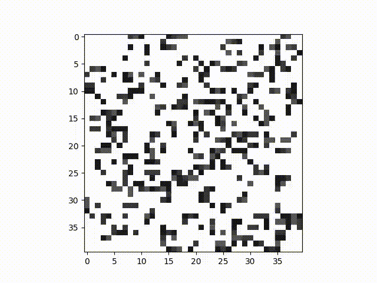

# Sample Game of Life

Options:
```
  -r, --random_config FLOAT RANGE
                                  Number between 0 and 1. Probability of
                                  setting a cell to dead.
  -columns, --number_of_columns INTEGER
                                  Number of grid columns.
  -rows, --number_of_rows INTEGER
                                  Number of grid rows.
  --config_file FILENAME
  -s, --speed INTEGER             Delay between frames in milliseconds.
  --save <TEXT INTEGER>...        Argument 1: Filename, Argument 2: frames. If
                                  set, the animation is saved to the file with
                                  the amount of frames.
  --help                          Show this message and exit.

```

Example:
Probability of 0.7:


